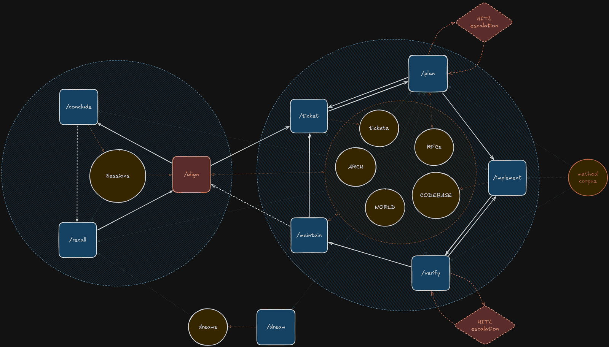

# GoodWolf Harness

Coding agents are capable engineers who forget everything when the session ends — and a different
one arrives next time. The harness gives that workforce an institutional memory in the repository:
what was decided and why, what is unfinished, what was verified and against what. Each session
reconstructs where the project stands from those records, not from a chat that is gone.

The harness is yours to change. Your project's own rules — its test commands, whether the agent may
commit without asking — go in one local file that every install and update applies last; to change
a shipped rule, you override it there by name. You can add skills of your own: `/mechanism`, the
skill for declaring one, walks you through it, and the same checks then hold your skill as hold the
shipped ones. And when a rule was in place but the agent didn't follow it, the case is written down
and the rule reworded — a postmortem aimed at the instructions instead of the code.

## How it works

A session starts with `/recall`, which reads the project's records and finds where the work
stopped. `/align` settles with you whatever needs deciding, and the work picks up from there — one
step or several, through as many pieces of work as the session holds — until `/conclude` writes
down what the next session needs. A piece of work moves `/ticket` → `/plan` → `/implement` →
`/verify` → `/maintain`: it becomes a ticket with checkable acceptance criteria, gets a written
plan, is built test-first where it can be, and is verified against its ticket, its plan and the
project's own checks. Whenever a step needs a decision, it goes back to `/align`. `/verify` checks
the change; `/maintain` keeps the system of knowledge — a separate step for drift, checking that the
repository's documents still agree with each other and with the code, and repairing what doesn't.



Decisions live in the architecture, ADRs and glossary; open work lives in tickets; session records
are history, never the authority on what is still open. What each record looks like is in its
format file: [tickets](.agents/skills/ticket/TICKET-FORMAT.md),
[ADRs](.agents/skills/align/ADR-FORMAT.md), [architecture](.agents/skills/align/ARCH-FORMAT.md),
[glossary](.agents/skills/align/GLOSSARY-FORMAT.md).

Where a person has to say yes is a switch — commit, push, start the next piece of work, split work
into tickets — each `ask` or `auto`, and one more for whether a clear rule violation is fixed and
reported or shown to you first:

```
commit=ask · push=ask · next-cycle=ask · breakdown=ask · repair=report
```

**Why a loop.** Agents need keeping in check — most of all when one picks up where another
stopped. Each step has an agent say what it will do and leave a record of what it did, so work can
stop at any step and any agent can pick it up from the records, and the next agent, or you, can
check the work instead of trusting it. You don't run the steps: the skills hand the work on to each
other around the loop, so none needs calling by hand. The skills, the records and most of the
vocabulary are the agent's working equipment, not a curriculum: you meet a few terms when it asks
you to decide something, and the records when you choose to read them. What you gain is observability — what was
decided, planned and verified, there to read when it matters. Every stop for your say is optional:
a switch set to `auto` lets the loop run on, and `commit=auto` commits each piece of work once it
is verified.

Every session opens the same way: it names the version of the rules it runs and reads where the
work stands. A session you drive by hand and one started to take a chunk of work unattended begin
from the same place.

The loop and its rules are in [AGENTS.md](AGENTS.md), every skill under
[`.agents/skills/`](.agents/skills/), and the harness's vocabulary in
[`.agents/glossary.md`](.agents/glossary.md).

## What holds it together

- **Two looks before a decision.** `/impact` looks inward: what a change touches in this project,
  and whether a mistake there would break one part or several. `/discover` looks outward: it hands
  the question to a separate agent that hasn't read the project, so you get an outside view of what
  the thing is and how things like it usually go wrong before settling on your own.
- **One home per rule.** A rule is written once, in its owner's rules file, and copied into every
  skill that reads it — in [AGENTS.md](AGENTS.md) you can see such a copy, `<installed by="ticket">`,
  whose source is [`ticket.rules.md`](.agents/mechanisms/ticket/ticket.rules.md). A copy that drifts
  from its source, or that nothing owns, fails the check.
- **Rules that fail get reworded.** When a rule was in place and the agent didn't follow it, the
  case is written down — which rules were in play, why this one didn't fire, how it is reworded —
  and the next time the situation comes up shows whether the rewording worked.
- **Every part of the method says what it is.** A skill that other work relies on is declared
  through `/mechanism`: its parts, the moments a person acts on it, what it produces and who reads
  that. A script checks the declaration is true.
- **The checks travel.** They are standard-library Python scripts with a test suite of their own.
  An install ends by running them inside your project, and your project can keep them in its own
  verification.

## Where it stands

**Works today**, in Claude Code, Codex and Cursor:

- Installing into a project, updating it, and checking the installed copy is intact, with your
  project's own rules applied last.
- Arriving in a project that already has something. The install refuses to write over an existing
  `CLAUDE.md` or `AGENTS.md`, so they are moved aside first; the installing agent then reads them,
  with your skills and documents, and works out with you, at `/align`, where each piece belongs —
  your facts and overrides into the local file, your own skills beside the shipped ones — and
  `CLAUDE.md` becomes a one-line pointer to the entry file. The first session after install then
  aligns with you on what the project is, and its architecture, decisions and glossary are written
  from there, deepening as the work reaches each part. It has come into a large existing codebase
  with no agent setup this way, and into a project with a smaller harness of its own.
- One home per rule, with drift detection; checks on the harness's own records and declarations.
  The harness is developed with itself.

**Not yet** — each item wrapped in this page's source as a *straw dog*,
`<straw-dog until="…" ticket="…">`, naming what retires it:

- <straw-dog until="01-0010.0150 is done" ticket="docs/tickets/01-0010.0150-harness-meets-a-tree-with-a-method.md">Arrival is guided by instructions, not by tooling: the script doesn't take its own inventory of what a project already has.</straw-dog>
- <straw-dog until="01-0010.0175 is done" ticket="docs/tickets/01-0010.0175-arrival-describes-what-it-finds.md">The script doesn't draft an architecture and glossary from a project's code and documents on arrival.</straw-dog>
- <straw-dog until="01-0020 settles switchable ceremony" ticket="docs/tickets/01-0020-pacer.md">There's no declared lighter process for small work, or heavier one for large — the agent and you choose it each time.</straw-dog>
- <straw-dog until="01-0010.0195 is done" ticket="docs/tickets/01-0010.0195-a-recipient-reads-before-it-takes.md">Updates don't say what changed.</straw-dog>
- <straw-dog until="01-0010.0200 is done" ticket="docs/tickets/01-0010.0200-a-project-can-remove-the-harness.md">There is no uninstall.</straw-dog>
- <straw-dog until="01-0010.0125 is done" ticket="docs/tickets/01-0010.0125-the-host-blocks-what-a-rule-forbids.md">The host doesn't block an action a rule forbids; the agent is trusted to keep it.</straw-dog>
- <straw-dog until="01-0017.0020 is done" ticket="docs/tickets/01-0017.0020-practice-swaps-in-one-edit.md">It assumes one person steering the agents: several developers on parallel branches would collide on ticket numbers in one shared queue, and a team's own tracker can't yet take the tickets' place.</straw-dog>
- <straw-dog until="a project's improvement reaches core by the harness's own path" ticket="docs/tickets/01-0010-dev-harness-shared-and-local.md">Improvements a project makes to the harness stay in that project.</straw-dog>

## Use it

```
git clone https://github.com/dveyarangi/goodwolf-harness.git
```

From your project's root, have your coding agent read
[`.agents/skills/harness/SKILL.md`](.agents/skills/harness/SKILL.md) in the clone and follow it. It
installs the harness, reports what arrived, and sets up your project's own rules with you — its
checks and its switches. What it runs is one script,
`python <clone>/.agents/scripts/gw/harness.py . --install`, which writes nothing if it refuses and
says why. Claude Code and Cursor reach the skills through directory links; where Windows refuses
to create one without an elevated prompt, the install finishes everything else and prints the
commands to run there, once. Updating to a later version and checking the installed copy are in
the same skill. Python 3.12 or later, standard library only. [MIT licensed](LICENSE).

To try it, install it into one project and watch three things over a few weeks: whether an agent
arriving cold re-decides less of what was already settled, whether work survives the end of a
session without you reconstructing it, and whether drift between documents and code falls rather
than documents merely piling up.
