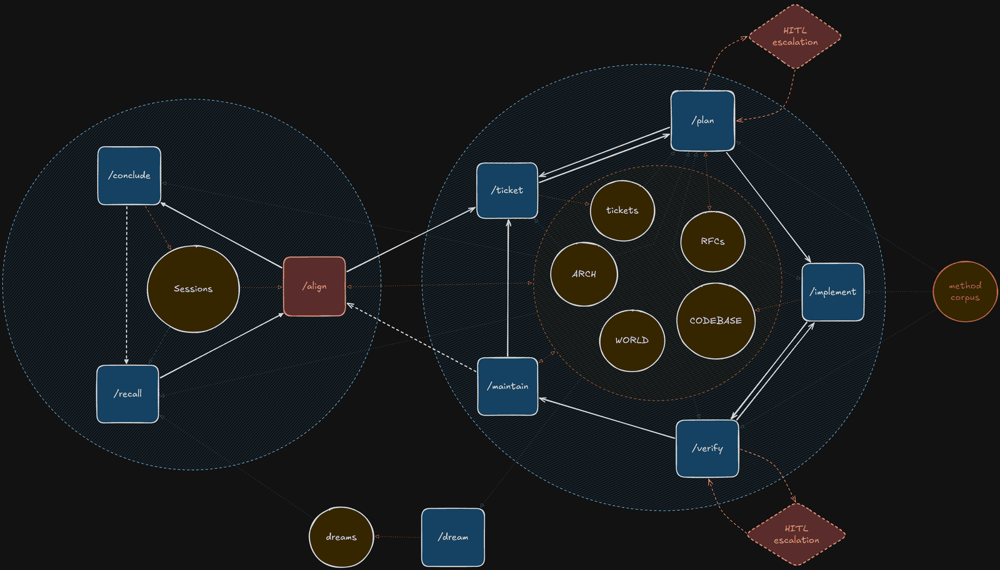

# GoodWolf Harness

Project memory and a working method for coding agents.

Every new session, a coding agent starts over knowing your code but not why it is the way it is,
what is still undecided, or where yesterday's work stopped. Working with agents on one project for
weeks hurts in three ways:

- **The agent is ineffective.** It calls work done that doesn't work, or isn't what you meant.
- **The agent is expensive.** Tokens, time and rework go on rediscovering what it already knew,
  and your attention goes on re-explaining it.
- **You are in the wrong place.** Either decisions that matter get made without you, or you end up
  approving every step and babysitting work the agent could carry.

GoodWolf answers all three from your repository: plain Markdown and a few standard-library Python
scripts, in Claude Code, Codex and Cursor.

**Try it:** in your project, tell your coding agent *install the GoodWolf Harness from
https://github.com/dveyarangi/goodwolf-harness*. It installs, then asks for your test commands and
where it should stop for your yes.
<straw-dog question="q-0018.0020.0001">If your project already has a `CLAUDE.md` or `AGENTS.md`, the install moves them aside and doesn't merge them yet, so branch first and bring over what you need by hand.</straw-dog>
More under [Use it](#use-it).

## What it does about each

**So the work is what you meant, and it works:**

- **What you decide gets built, and stays built.** A plan pulls the code toward it until the work
  matches. A decision about the architecture binds the code from then on: code that drifts from it
  is brought back, never the decision bent to fit the code, and it changes only when you decide
  again.
- **Done means checked.** Each change becomes a ticket with checkable criteria and a written plan,
  is built test-first, and is verified against the ticket, the plan and your tests before it
  counts as done.
- **Instructions that reach the agent.** Each rule lives in one place and is copied by a script to
  wherever it is read, and a check fails if a copy drifts. So the agent isn't working from
  scattered, contradictory instructions.

**So you stop paying twice:**

- **A memory of the project, not just of the code.** What was decided and why, what is half-built
  and at which step, and what is still undecided are kept as files. Every session starts from them,
  so "continue" is enough.
- **Nothing you raise is lost.** Every open question is kept until it is answered, with where the
  thinking had got to, and the ones you keep returning to come up first. Each message is placed
  under the question it is about, so a side remark is noted instead of derailing the work.

**So you are where it matters, and nowhere else:**

- **Decisions go by their weight.** A decision whose mistake would break several parts of the
  project comes to you, with the agent's recommendation. Anything smaller the agent settles and
  tells you about. When it is unsure which one it is, it asks.
- **You set the stops.** Commit, push, starting the next piece of work, splitting work into tickets:
  each is `ask` or `auto`. Out of the box, everything asks.
- **You can see what it stands on.** Every step leaves a short record you can read, so checking the
  agent's work is cheap and trusting it isn't blind.
- **You can think out loud.** Jump from topic to topic. What you say lands under the question it
  belongs to and comes back when that topic does.

**Two goals it can't promise yet:**

- **Better over time, not worse.** One home for every decision, a maintenance pass that keeps
  documents and code in agreement, and rules reworded each time the agent ignores one all point
  this way. Nothing yet measures whether it holds.
- **No harm.** The harness's own scripts refuse rather than overwrite, and push waits for your yes.
  Nothing yet bounds what the agent itself may do.

## A morning with it

An illustration: the project is made up; the steps are what the harness does.

**You:** continue

**Agent:** Picking up from yesterday. The export endpoint landed, but one of its acceptance checks
is still open: the CSV header test was never written. Next in the queue is the import endpoint.
And your question from Tuesday — do retries need idempotency keys? — is still open; we were
leaning yes. Close out the export first?

**You:** Yes, then import.

*It writes the test, ticks the check, and plans the import. Halfway through, it stops.*

**Agent:** `docs/architecture.md` doesn't say whether an import is all-or-nothing or row by row.
I'd go all-or-nothing: a half-applied import is hard to undo. Your call?

**You:** All-or-nothing.

**Agent:** Added to `docs/architecture.md`, with the reason.

*It builds the import test-first, runs your tests, checks the result against the ticket, and
asks before committing.*

**You:** Oh — exports will need paging at some point.

**Agent:** Noted as an open question under exports. It will come up again when you next work on
exports.

*Two days later, a fresh session:*

**You:** Let's make imports row by row, it's simpler.

**Agent:** Two days ago we settled on all-or-nothing, because a half-applied import is hard to
undo. Has something changed? If so, I'll reopen it and record why.

You don't type the steps or learn the commands. The agent moves the work along and stops wherever
you have told it to ask.

## Who it is for, and what it costs

It is for **one person steering agents on a project that lives for months** — a long-lived
product, a large refactor, a codebase you return to between other work — where forgetting costs
more every week. It is not worth it in a prototype's first week, when there is nothing settled yet
to keep, or for one-off scripts.

Before you install, know this:

- <straw-dog question="q-0033.0004">**One person, not a team, for now.** Several developers on parallel branches would collide on ticket numbers in one shared queue, and your team's tracker can't yet take the tickets' place.</straw-dog>
- <straw-dog question="q-0027.0003">**No fast path for small work yet.** Every change is meant to go through ticket, plan, build and verify. You can tell the agent to skip that for a one-line fix, but nothing yet says when that is fine.</straw-dog>
- <straw-dog question="q-0018.0005">**Instructions, not enforcement.** Everything here is the agent following written rules, plus scripts that check the files. A model can still slip; the records make the slip visible, and the rule it missed gets reworded.</straw-dog>
- <straw-dog question="q-0018.0013">**No uninstall command.** Everything it adds is files, so reverting the install commit removes the harness. What it wrote under `docs/` afterwards stays until you delete it.</straw-dog>
- **Context.** A fresh project's session starts with about 4,000 tokens of rules and skill
  descriptions. In this repository, after a month of daily use, a session reads about 22,000
  before your first message: about 4,400 of rules and skill descriptions, 2,700 of status report, and
  <straw-dog question="q-0024.0009">15,000 of work queue, most of it a history log that is being moved out of it</straw-dog>.

<straw-dog question="q-0017">What it saves has not been measured. To judge it, install it into one project and watch three things over a few weeks: whether an agent arriving cold re-decides less of what was settled, whether work survives the end of a session without you reconstructing it, and whether drift between documents and code falls rather than documents piling up.</straw-dog>

## It changes with your project

Rule files for agents rot. Rules pile up and contradict each other, the agent quietly ignores
some, and your edits get overwritten when you pull an update. Here:

- **Your changes survive updates.** Your test commands, your approval settings, and any shipped
  rule you want different go in one file, `local.rules.md`. Every install and update applies it
  last and never touches it. If you edited a shipped file by hand instead, an update stops and
  tells you rather than overwrite it.
- **A rule the agent ignored gets reworded, and the next miss shows whether that worked.** When a
  rule was in place and not followed, the agent logs the miss in `docs/rule-failures.md`, shows
  you the rewording, and lands it as one commit you can review and revert.
  <straw-dog question="q-0026">So far it is you who notices the miss: every one in this repository's log was caught by the person, not the agent.</straw-dog>
- **No two copies of a rule disagree.** Each rule is written in one place and copied by a script
  into every instruction that uses it. A check fails if a copy drifts from its source; it runs at
  every install and update, and in your own checks if you add it there.
- **Your own skills get the same checks.** A guided command, `/mechanism`, walks you through adding
  one, and the scripts that check the shipped skills then check yours.
- **Anything provisional says what it waits on.** A rule that will change once an open question is
  answered names that question, and the session report tells you when the answer has landed.

**An example from this repository's log.** One rule tells the agent to file each of your
messages under the open question it belongs to. On 5 October, new sessions kept filing messages
under questions that only sounded similar. Each time, the miss was logged and the rule tightened —
four times that day — until it said: file a message under the narrowest question that actually
covers it, never under one that merely looks alike. The sessions after that got it right. The
harness has been built with itself for a month, over 45 sessions, and its log holds 26 misses so
far.

To override a shipped rule, add a section naming it. This one, from this repository, replaces the
plain symbols in the per-reply status table with emoji:

```markdown
## L6 — the glyphs are anchors

- **target** `AGENTS.md`
- **authority** the user, 2026-10-07
- **overrides** `questions/Q1`

<rule>
In this tree the table's glyphs are emoji — 📍 for the question the turn ends on, …
</rule>
```

## How it works

**When a document and the code disagree, which one is fixed.** Every written thing in the
project is one of four kinds, and the kind says which side wins.

| the document says | who is right | when they disagree | for example |
|---|---|---|---|
| what it intends to become | the document, until the code gets there | the code moves toward it; the document is done once they match | a ticket, a plan, a spec |
| what must always hold | the document, always | the code is fixed; the document changes only by a decision | the architecture, the glossary |
| what exists | the code | the document is rebuilt from the code, never edited by hand | the ticket list, a check's report |
| what happened | neither — it is past | nothing is fixed | a session record, a finished ticket |

**How the right things reach the agent.** There is no vector database and no similarity search;
what the agent reads is chosen by which question you are on. Open questions form a tree, each
under the one it is part of. When a session starts, the agent reads a status report: the open
questions you keep returning to, the ones parked until a condition that may now hold, and what
other running sessions are on. Before each reply it reads the part of the tree around the
question you are on, and follows links from there.

**The steps.** You won't type these; they are the names you will see in the agent's replies. A
session starts with `/recall`, which finds where the work stopped; `/align` settles with you
whatever needs deciding; `/conclude` writes down what the next session needs. A piece of work
moves `/ticket` → `/plan` → `/implement` → `/verify` → `/maintain`; large work is first agreed with
you as a spec and split into small tickets. `/verify` asks whether finished work keeps the
promises its ticket and plan made; `/maintain` asks whether the documents still agree with each
other and with the code. Before a big decision, `/impact` traces what a change touches in this
project, and `/discover` asks a separate agent that has not read the project how things like it
usually go wrong elsewhere.



The rules are in [AGENTS.md](AGENTS.md) and every skill is under [`.agents/skills/`](.agents/skills/).

## Where it stands

**Works today**, in Claude Code, Codex and Cursor:

- Installing into a project, updating it, and checking that the installed copy is intact, with
  your own rules applied last.
- Arriving in a project that already has code: the first session after install works out with
  you what the project is, and writes its architecture, decisions and glossary from that
  conversation, deepening as the work reaches each part.
- The open-question tree, with every message placed in it before the reply.
- Each rule kept in one place, and checks on the harness's own files, run at install and update.

**Not yet:**

- <straw-dog question="q-0032">Sessions see where the others stand, but nothing locks: two sessions can still edit the same file.</straw-dog>
- <straw-dog question="q-0027.0002">You can't yet say which kinds of decision stop for you; the line between yours and the agent's is drawn by its judgement of what bears load.</straw-dog>
- <straw-dog question="q-0018.0011.0004">The install doesn't yet find what your project exists to solve, or the answers already built into its docs and code; the first session builds them with you instead.</straw-dog>
- <straw-dog question="q-0018.0020.0002.0003">Updates name the files they changed, not what changed in them or what your project has to do about it.</straw-dog>
- <straw-dog question="q-0018.0018">There is no way yet to send improvements your project makes to the harness back upstream.</straw-dog>
- <straw-dog question="q-0018.0023">Other hosts — Copilot, Gemini CLI, OpenCode and the rest — aren't supported yet.</straw-dog>

## Use it

```
git clone https://github.com/dveyarangi/goodwolf-harness.git
```

From your project's root, have your coding agent read
[`.agents/skills/harness/SKILL.md`](.agents/skills/harness/SKILL.md) in the clone and follow it. It
installs the harness, reports what arrived, and sets up your project's own rules with you. The
install itself is one script you can run and read first,
`python <clone>/.agents/scripts/gw/harness.py . --install`, which writes nothing if it refuses and
says why. Updating and checking the installed copy are in the same skill.

What lands in your repository: `.agents/` (the skills, the scripts and their tests), `AGENTS.md`
(the rules every session reads), a one-line `CLAUDE.md` pointing to it, and a starting work queue
in `docs/tickets/`. `local.rules.md` and the rest of `docs/` — architecture, decisions, questions,
session notes — are written as you work. Claude Code and Cursor reach the skills through symbolic
links the install makes in each clone; on Windows, where creating one may need an elevated
prompt, it prints the command to run.

Python 3.12 or later, standard library only. [MIT licensed](LICENSE).
